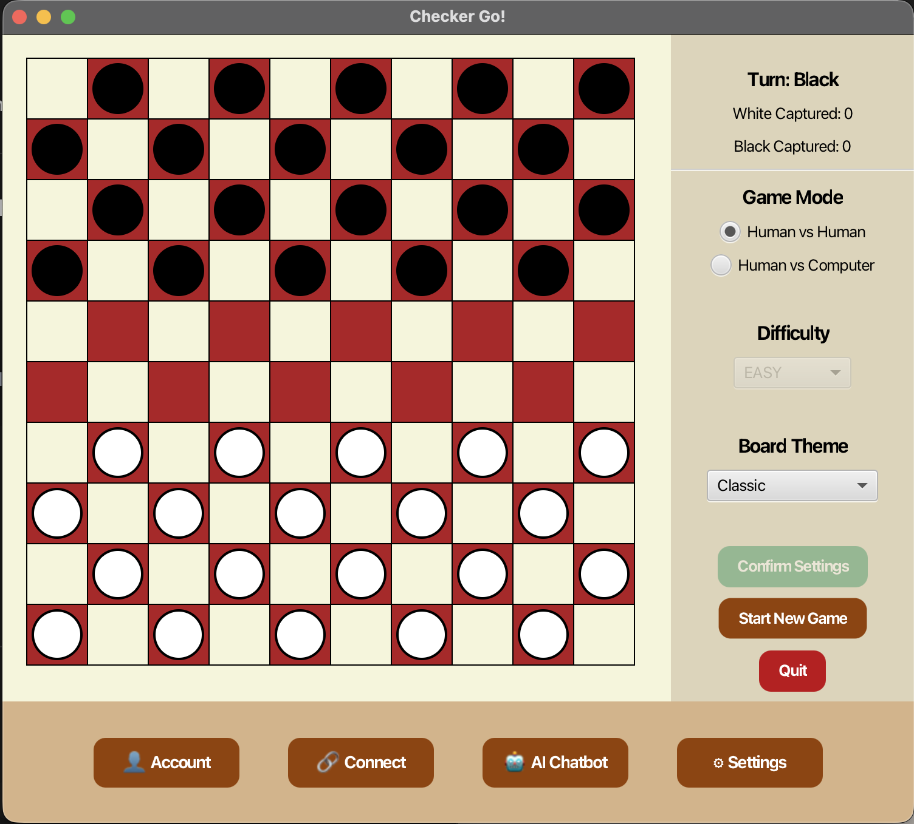
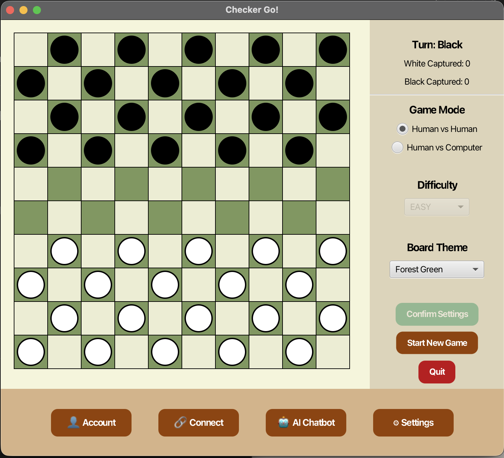
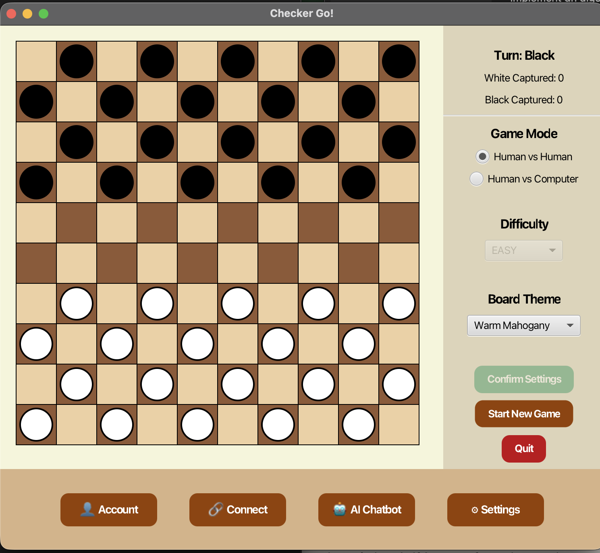
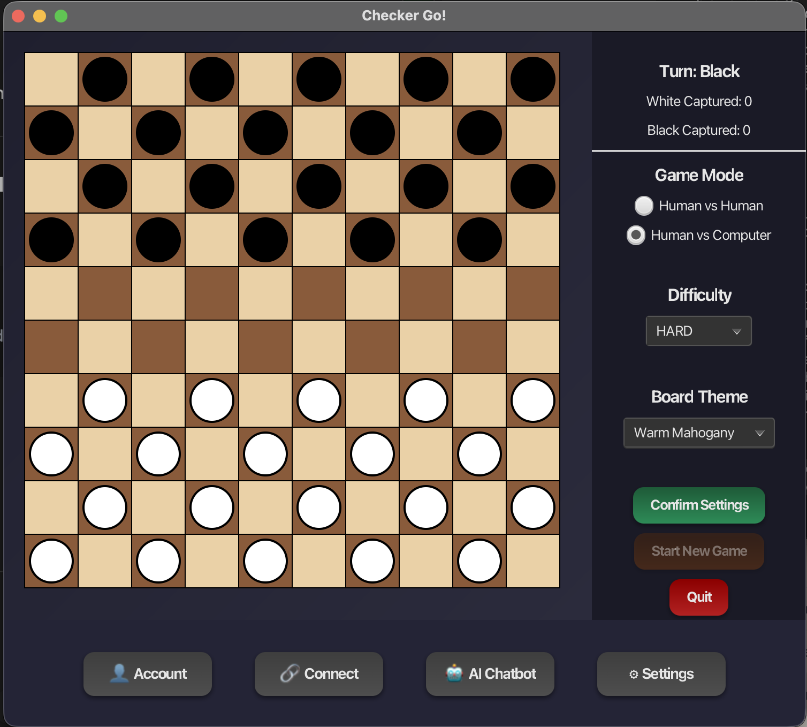
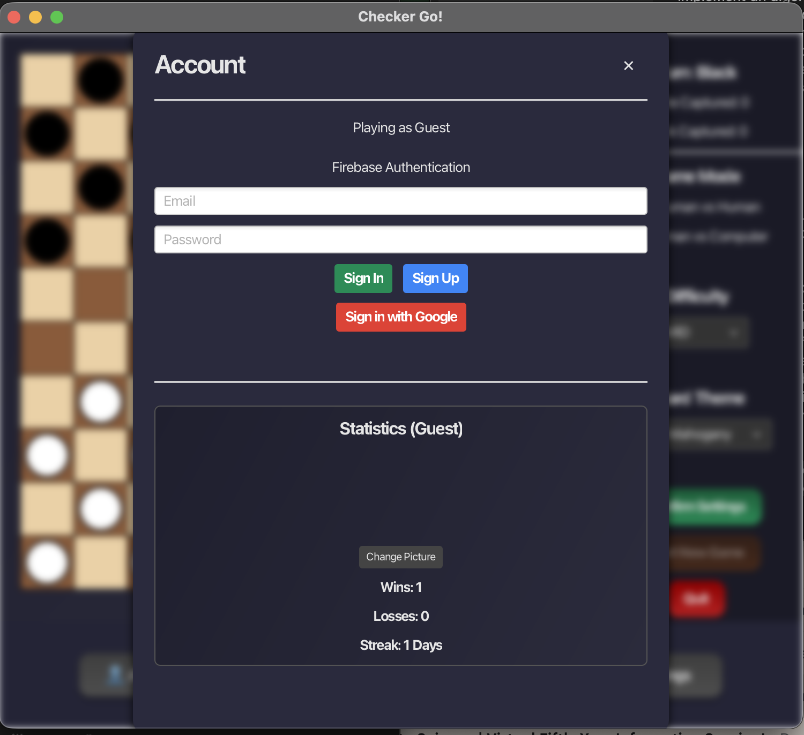

# 🎭 Checker_Go
A Java-based Checkers game built with JavaFX featuring three AI difficulty levels (easy, intermediate, hard) and a secure authentication system that enables online multiplayer and performance tracking. The project also integrates an AI-powered strategy chatbot to help players learn tactics, analyze gameplay, and improve their chances of winning.
<p align="center">
  
</p>

## ✨ Game Specifications
 Checkers is a two-player strategy board game played on an 8×8 board where each player starts with 12 pieces placed on the dark squares of the three rows closest to them. Players take turns moving one piece diagonally forward to an adjacent empty square; if an opponent’s piece is directly adjacent and the square beyond it is empty, the player must capture by jumping over that piece, removing it from the board. **Captures are mandatory (Forced Jumps)**: If a capture is available, the player *must* take it. If multiple jump sequences are available, the player *can* choose which sequence to take, but they cannot choose a non-capturing move. Multiple jumps can be made in a single turn if successive captures are possible. When a piece reaches the opponent’s back row, it is promoted to a king, which can move and capture diagonally both forward and backward. The game ends when one player has no pieces left or no legal moves remaining, at which point the other player wins.

## 🚀 Feature Integrations

### 1. Board customization
The Confirm Settings logic has been adjusted so that any new settings—whether related to the game mode or the board color are applied by starting a new game. When Start New Game is selected, the game begins immediately, while the control settings remain unchanged. This ensures that pressing Confirm only applies the updated settings without resetting the existing control configuration.
<p align="center">
  
  
</p>


### 2. Dark Mode & UI Theming
A fully integrated **Dark Mode** has been added to enhance visual comfort during gameplay.
*   **Dynamic Theming**: Users can toggle between Light and Dark modes instantly via the settings menu.
*   **CSS-Based Styling**: The application utilizes a robust CSS architecture (`light.css` and `dark.css`) managed by a `ThemeManager` to switch styles dynamically without restarting the application.
*   **Consistent UI**: All UI components, including buttons, dropdowns, and stats panels, have been standardized with rounded corners and hover effects to maintain a cohesive look across both themes.
<p align="center">
  
</p>

### 3. Authentication & Cloud Data (Firebase)
The application now integrates with **Firebase Authentication** to provide secure user management and persisted profiles.
*   **Sign Up/Sign In**: Users can create accounts with email/password or use a simulated Google Sign-In flow. Otherwise, you can just play as a guest
*   **Persistent Stats**: User statistics (wins, losses, streaks) and profile customization (display name, profile picture) are stored locally and persisted across sessions using `UserDataManager`.
*   **Personalization**: Users can upload custom profile pictures which are displayed in the Account and Matchmaking views.
<p align="center">
  
</p>

### 5. Online Connect & Multiplayer
The "Connect" feature simulates a modern online multiplayer experience, allowing players to find opponents or create private lobbies.
*   **Matchmaking System**: An asynchronous search algorithm simulates finding active players, displaying their names, avatars, and ranks.
*   **Private Rooms**: Users can create private lobbies with a **unique 6-character alphanumeric code** (e.g., `A7X92B`) to invite friends. The code is copyable for easy sharing.
*   **Fallback Options**: If no online players are found, the system intelligently proposes playing against the computer or a local friend to keep the user engaged.
<p align="center">
  
</p>

### 4. AI Strategy Coach (Google Gemini API)
An intelligent chatbot powered by **Google's Gemini 1.5 Flash Model** has been integrated to serve as a personal checkers coach.
*   **Advisory Role**: The AI analyzes the player's questions about strategy and provides advice in real-time.
*   **Implementation**: Utilizes the `v1beta` REST API for fast, efficient responses directly within the JavaFX interface.
*   **Privacy**: Users have the option to opt-in/out of sharing game data for analysis in the AI chat settings.
<p align="center">
  
</p>

## 🤖 AI Difficulty Levels Implementation
The computer opponent (`ComputerPlayer`) has been refactored to use a Strategy Pattern, allowing for pluggable AI implementations implementing the `MoveStrategy` interface.

### 1. Easy Mode (`EasyAI`)
- **Strategy:** Random Selection.
- **Implementation:** The AI identifies all legal moves on the board using a lightweight board simulation (`VirtualBoard`). From this list, it selects one move completely at random.
- **Complexity:** Depth 0 (No lookahead).

### 2. Medium Mode (`MediumAI`)
- **Strategy:** Minimax Algorithm.
- **Implementation:** Uses a Minimax search algorithm with a depth of 4 plies. It simulates future board states to minimize potential losses and maximize gains.
- **Evaluation:** Scores board states based on piece count and King count (Kings are weighted 3x higher than regular pieces).
- **Expectation:** The computer plays defensively and tactically, looking several moves ahead to avoid traps.

### 3. Hard Mode (`HardAI`)
- **Strategy:** Minimax with Alpha-Beta Pruning.
- **Implementation:** Uses an optimized Minimax algorithm with Alpha-Beta pruning to search deeper (depth 6) without performance penalties.
- **Evaluation:** employs a sophisticated evaluation function considering:
    - **Material:** Piece and King counts.
    - **Center Control:** Bonus for controlling the center columns (3-6).
    - **Promotion Potential:** Bonus for advancing pieces toward the King row.
- **Expectation:** The computer plays highly aggressively and strategically, competing for board control and utilizing advanced heuristics to outsmart the opponent.

## 🛠️ Testing
The project includes a suite of unit tests to ensure the reliability of core components, particularly the integrations with external services (Gemini AI) using **JUnit 5** and **Mockito**.
And all the tests pass with a success rate of `100%`

### 1. AI Coach Service Tests (`GeminiApiTest`)
*   **Scope:** Validates the `GeminiService` which powers the AI Chatbot.
*   **Methodology:** Mocks both the `HttpClient` for API calls and the `UserDataManager` to simulate user states without relying on local files.
*   **Scenarios Covered:**
    *   **Prompt Construction:** Ensures that player statistics (wins, losses, streak) are correctly formatted into the context prompt sent to the LLM.
    *   **Response Parsing:** Verifies that the nested JSON structure returned by the Gemini API is correctly parsed to extract the advice text.
    *   **API Failures:** Checks that appropriate fallback messages are returned when the API responds with errors (e.g., 500 Internal Server Error) or during network outages.

### How to Run Tests
To execute the full test suite, run the following command in your terminal:
```bash
mvn test
```

## 🎯 How to?
Git repository: https://github.com/diriho/Checker_Go.git

This program uses Maven as an automation and dependency management tool. 
If you don't have Maven in installed on your computer, run the followig commands in your terminal
For Mac run:
```bash
brew install maven 
```
To verify maven installation, run:
 ```bash
 mvn -version
 ```
Install or upgrade you java JDK: 
```bash
brew install openjdk
sudo ln -sfn /opt/homebrew/opt/openjdk/libexec/openjdk.jdk /Library/Java/JavaVirtualMachines/openjdk.jdk
```
And to verify if it was successfully installation run:
```bash
java -version
javac -version
```

For Windows run :
```bash
choco install maven -y
```
To verify maven installation, run: 
```bash
mvn -version
```
Install or upgrade you java JDK: 
```bash
choco install openjdk -y
```
And to verify if it was successfully installation run:
```bash
java -version
javac -version
```

Once you have your JDK and Maven ready running, run this in your terminal to compile and run the program:
```bash
mvn compile
mvn javafx:run
```
Shortcut: 
``` bash
mvn clean compile javafx:run 
``` 

## 👤 Author

**[diriho](https://github.com/diriho)** and **[pkedego](https://github.com/pkedogo)**

---

Built with 🤎🤎🤎 using Java, JavaFX, CSS, and GitHub Copilot 